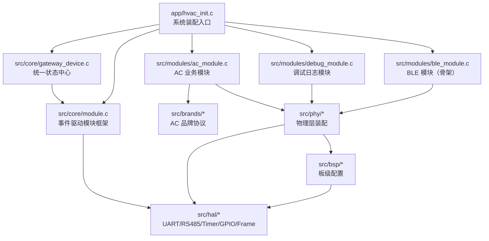
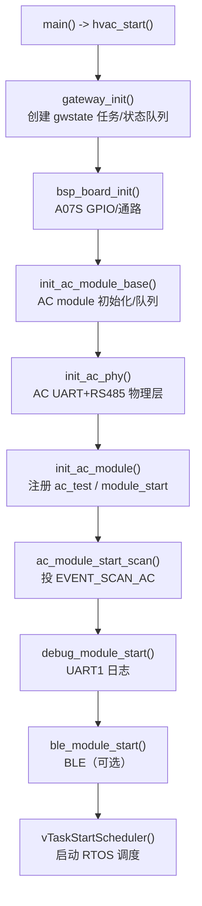

# ARCHITECTURE.md — 系统总体架构

> 目的：让你不需要重新读代码，就能从整体掌握这套 BLE/AC 网关系统。
> 配套文档：`docs/程序流程框架图.md`、`docs/MODULE_MAP.md`

---

## 1. 系统定位

这是一套跑在 **CH579 (Cortex-M0)** 上的 **BLE + 空调/新风网关**。

当前主链路：

```text
上位机/BLE
   ↓ 控制命令
网关状态中心 gateway_device
   ↓ 状态同步/命令
AC 模块 ac_module
   ↓ 品牌协议
ac_test（Modbus RTU 测试协议）
   ↓ RS485
空调/新风从站
```

当前实机已验证：
- AC RS485 scan/品牌锁定 PASS
- 锁定后 2s 周期轮询稳定
- 30/30 干净应答，零噪声
- 24h+ 长时间运行无 hardfault

---

## 2. 硬件资源分配

| 资源 | 用途 | 说明 |
|------|------|------|
| UART0 | AC/RS485 | PB4=RX, PB7=TX，9600-8N1 |
| UART1 | Debug 日志/命令 | 115200-8N1 |
| UART2/3 | 预留 | 当前未用 |
| TMR0 | AC 接收帧超时 | `timer_hw_create(0)` |
| TMR1 | Debug 接收帧超时 | `timer_hw_create(1)` |
| TMR2 | 共享 1ms 软定时器 tick | 供 AC/Debug sender_poll 共用 |
| TMR3 | FreeRTOS Run Time Stats | 1ms 中断累加运行计数 |
| PA14/PA15 | AC 接收通路选择 | 必须推挽输出低，不能浮空 |
| PB5 | RS485 DE | 发送方向控制 |
| PB6 | RS485 RE | 发送方向控制 |
| PB4 | UART0 RX | 上拉输入 |
| PB7 | UART0 TX | 推挽输出 |
| COM5 | UART1 Debug | 115200 |
| COM7 | UART0 AC/RS485 | 9600 |

---

## 3. 整体分层



### 依赖规则

```text
业务/模块层  →  品牌层        （AC 模块调用 protocol_ops）
模块层      →  物理层        （注入 sender/receiver）
物理层      →  HAL / BSP
品牌层      →  不碰模块内部   （只写协议帧/解析）
模块层      →  不碰具体引脚   （引脚在 BSP）
```

---

## 4. 核心设计思想

### 4.1 每个模块 = 一条独立“总线通道”

```text
module_t
├── send_task    发送事件处理任务（P3）
├── receive_task 接收事件处理任务（P4）
├── send_queue   发送事件队列
├── receive_queue 接收事件队列
├── poll_timer / tick_timer / gap_timer
├── bus          半双工总线状态
├── sender       发送器
└── receiver     接收器
```

### 4.2 模块内部事件驱动

事件统一走 `event_t`：

```c
EVENT_PERIODIC_SEND  周期轮询
EVENT_RX_FRAME       收到完整帧
EVENT_GATEWAY_CMD    网关命令/状态同步
EVENT_SCAN_AC        启动 AC 扫描
EVENT_TICK           100ms tick
EVENT_BUS_IDLE       帧间隔结束，可发下一帧
EVENT_AC_RX          AC 接收解析后通知发送状态机
EVENT_SEND_FRAME     投递一帧发送
EVENT_DEBUG_TX       Debug 模块发送日志
```

### 4.3 统一状态中心

所有模块共享 `gateway_state_t`：

```c
power / mode / set_temp / room_temp / fan / swing / error_code
mode_caps / fan_caps / swing_caps / temp_min / temp_max / temp_step / features
```

状态更新流程：

```text
AC 收到应答
   → ac_state_t（协议状态）
   → gateway_state_t（统一状态）
   → module_update_state()
   → gateway_module_state_update()
   → 通知 Debug/BLE 观察者
   → 状态同步到其他模块
```

---

## 5. 初始化顺序



---

## 6. 运行时五大主流程

### 6.1 初始化/装配流

```text
hvac_start
  → bsp_board_init
  → ac_module_base_init
  → ac_phy_init
  → ac_module_register/start
  → debug_module_start
```

### 6.2 AC 扫描/锁定流

```text
poll/scan 事件
  → send_task: ac_module_scan_next()
  → current = ac_test
  → on_scan 组查询帧 01 03 00 00 00 07 04 08
  → sender_send → RS485
  → 从站应答
  → receive_task: rx_parse()
  → 解析成功
  → locked=1
  → 状态同步到网关
  → 通知 send_task 跑品牌状态机
```

### 6.3 锁定后轮询流

```text
poll_timer 2s
  → EVENT_PERIODIC_SEND
  → AC_EV_POLL
  → state_machine 组读寄存器帧
  → 发送
  → 收应答
  → rx_parse 更新状态
  → 状态上报
```

### 6.4 接收流

```text
UART0 RX 中断
  → uart_decoder 收字节
  → receiver_timeout 组帧
  → module_rx_frame_done()
  → receive_queue
  → receive_task
  → module_handle_rx()
  → rx_log（可选）
  → ac_module_on_rx_frame()
  → protocol_ops->rx_parse()
```

### 6.5 控制/状态同步流

```text
上位机/BLE 下发
  → gateway_send_cmd()
  → module_send_gateway_cmd()
  → EVENT_GATEWAY_CMD
  → send_task
  → ac_module_on_gateway_cmd()
  → 更新 gateway_state
  → state_machine 组控制帧
  → 发送到 AC
```

---

## 7. 模块 ID 分配

| ID | 模块 | 当前状态 |
|----|------|----------|
| 0 | AC | 已实现，主链路 |
| 1 | Debug | 已实现，日志/命令 |
| 2 | BLE | 骨架/可选 |
| 3 | 预留 | — |
| 4 | 预留 | — |

---

## 8. 关键目录地图

```text
app/
  hvac_init.c         系统装配
  isr.c               定时器/UART 中断入口
  main.c              入口

src/
  core/
    module.c          模块框架：任务/队列/定时器/事件分发
    gateway_device.c  网关状态中心
    event_handler.h   事件类型/事件表
  modules/
    ac_module.c       AC 扫描/锁定/轮询/状态机调度
    debug_module.c    日志/命令/心跳/统计
    ble_module.c      BLE 骨架
  brands/
    ac_brand.h        品牌表/协议 ops/状态/能力
    ac_test.c         测试品牌 Modbus RTU
  phy/
    ac_phy.c          物理层分发
    ac_phy_rs485.c    AC UART+RS485 装配
    debug_phy.c       Debug UART1 装配
    ble_phy.c         BLE 物理层
  bsp/
    bsp_a07s.c        A07S 板级引脚/通路配置
  hal/
    bus/              半双工总线
    frame/            sender/receiver
    uart/             UART 驱动
    rs485/            RS485 DE/RE
    timer/            定时器
    gpio/             GPIO
    queue/            环形队列
```

---

## 9. 设计约束/经验

1. **不要从品牌层碰模块内部**
   - 品牌只实现 `rx_parse` / `state_machine` / `on_scan`
   - 发送/定时/队列全部由模块层做

2. **不要从物理层硬编码板级引脚**
   - AC 物理层从 `bsp_ac_phy_cfg()` 读 UART/DE/RE
   - 换板改 `bsp_a07s.c`

3. **中断里不要直接做重活**
   - UART/Timer 中断只做：清标志、读字节、投事件
   - 实际解析/组帧/日志都在任务里

4. **RS485 换向必须等 TX 完全结束**
   - `bus_mark_busy` 发送方向
   - `bus_mark_idle` 等 TX_COMPLETE 后再回接收
   - `tx_active` 防止 RX 抢方向

5. **PA14/PA15 不能浮空**
   - 这是接收通路选择引脚，必须推挽输出低

6. **日志是运行时地图**
   - `[ac evt] rx:` 收帧
   - `[ac] brand locked` 锁定
   - `[gw] module=...` 状态变化
   - `[diag] up=... rs485 dir tx/rx` 长稳统计
   - `[up]` 运行时长
   - `[task]` FreeRTOS 任务运行统计
