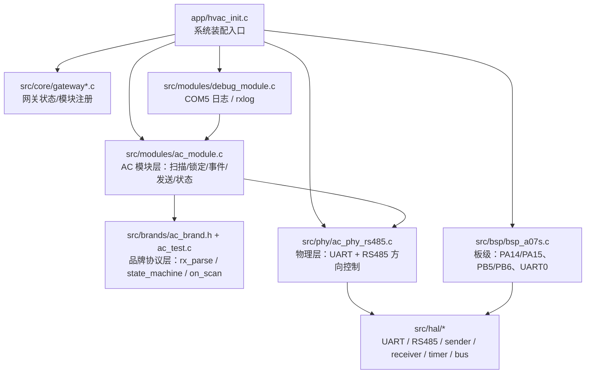
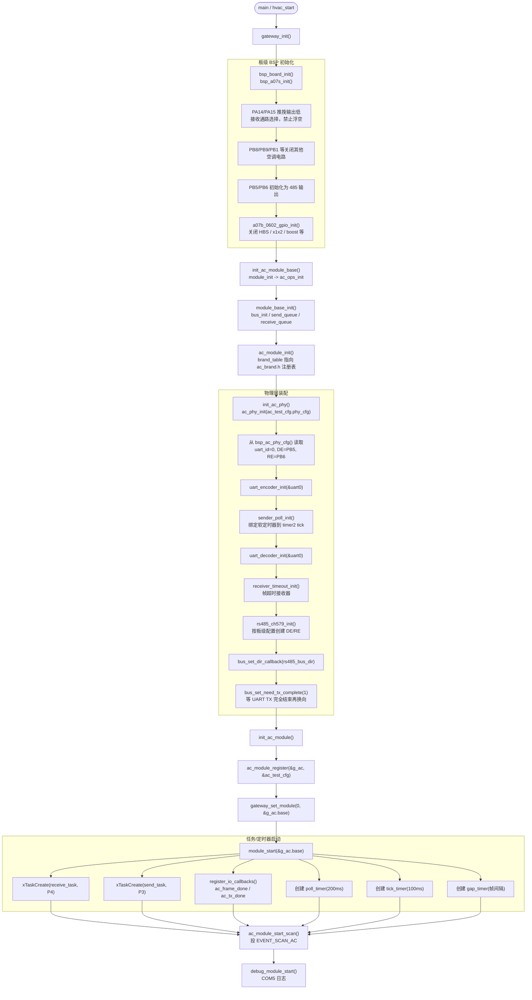
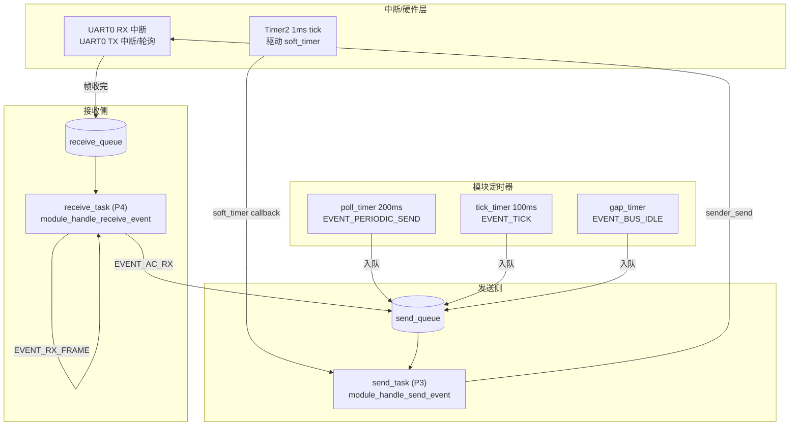
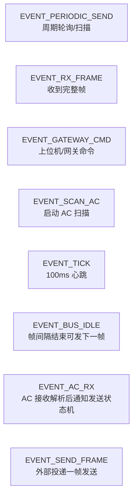
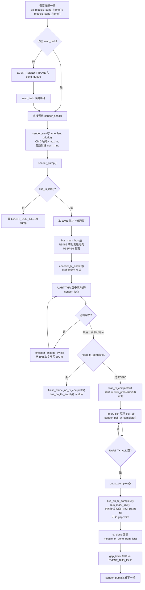
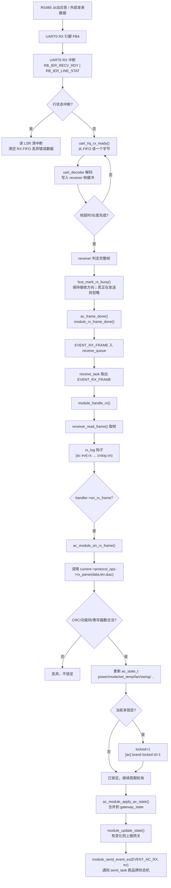
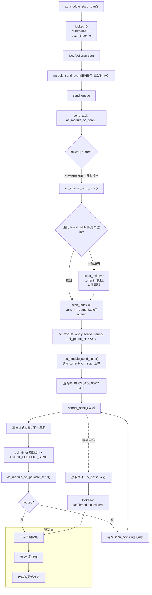
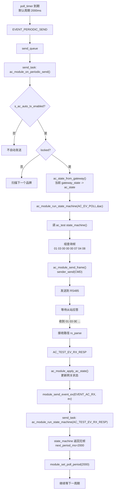
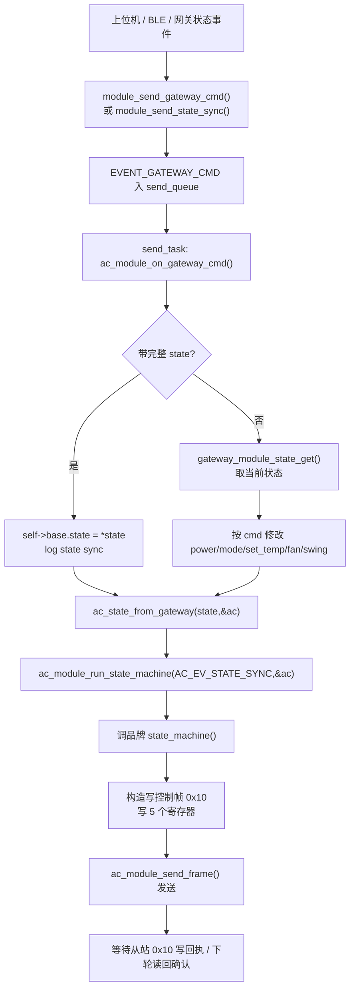
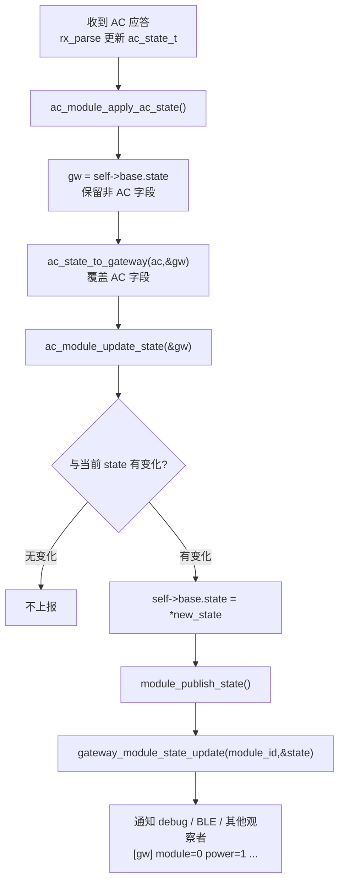

# 程序流程框架图（详细版）

> 适用代码：AC 网关框架（模块化事件驱动 + 品牌协议表 + RS485 物理层）
> 绘图语法：Mermaid
> 建议打开方式：GitHub / Typora / VS Code(Markdown Preview Mermaid Support) / mermaid.live

---

## 0. 目录

1. 分层结构
2. 上电初始化流程
3. 模块任务与事件队列模型
4. 发送路径详细流程
5. 接收路径详细流程
6. AC Scan / 品牌锁定详细流程
7. 锁定后周期轮询详细流程
8. 网关控制命令 / 状态同步流程
9. AC 状态更新与上报流程
10. 关键代码位置对照表

---

## 1. 分层结构

---

## 2. 上电初始化流程

---

## 3. 模块任务与事件队列模型

事件类型对照：

---

## 4. 发送路径详细流程

---

## 5. 接收路径详细流程

---

## 6. AC Scan / 品牌锁定详细流程

---

## 7. 锁定后周期轮询详细流程

---

## 8. 网关控制命令 / 状态同步流程

---

## 9. AC 状态更新与上报流程

---

## 10. 关键代码位置对照表

| 流程 | 主要代码 |
|------|----------|
| 系统装配 | `app/hvac_init.c` |
| 板级配置 | `src/bsp/bsp_a07s.c` |
| 模块公共任务/队列 | `src/core/module.c` |
| 模块事件类型 | `src/core/event_handler.h` |
| AC 模块扫描/锁定/发送 | `src/modules/ac_module.c` |
| 品牌协议表 | `src/brands/ac_brand.h` |
| 测试品牌协议 | `src/brands/ac_test.c` |
| RS485 物理层装配 | `src/phy/ac_phy_rs485.c` |
| 发送器 | `src/hal/frame/sender.c` |
| 发送完成轮询 | `src/hal/frame/sender_complete_poll.c` |
| 总线/方向控制 | `src/hal/bus/bus.c` |
| UART 驱动 | `src/hal/uart/uart_ch579.c` |
| RS485 DE/RE 驱动 | `src/hal/rs485/rs485_ch579.c` |
| RX 日志 | `src/modules/debug_module.c` |
